## Решение задания 1

Создание Deployment приложения, состоящего из двух контейнеров:
https://github.com/cranberry511/kuber-homeworks_1.4/blob/main/deployment-multi-container.yaml
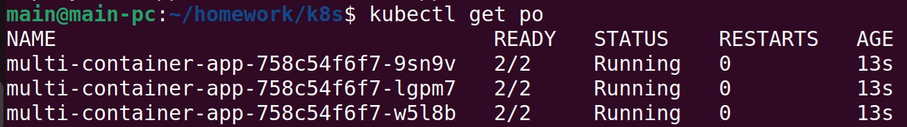

Создание Service типа ClusterIP:  
https://github.com/cranberry511/kuber-homeworks_1.4/blob/main/service-clusterip.yaml
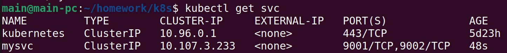

Проверка доступности:
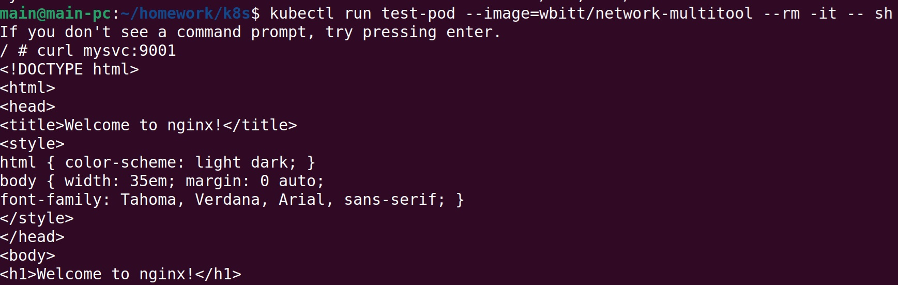

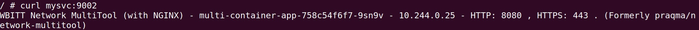

Создание Service типа NodePort:
https://github.com/cranberry511/kuber-homeworks_1.4/blob/main/service-nodeport.yaml
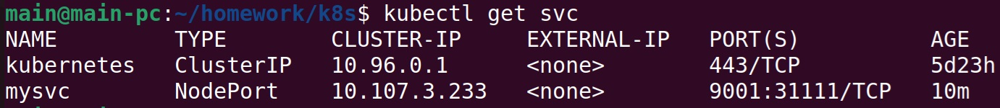

Проверка доступа:
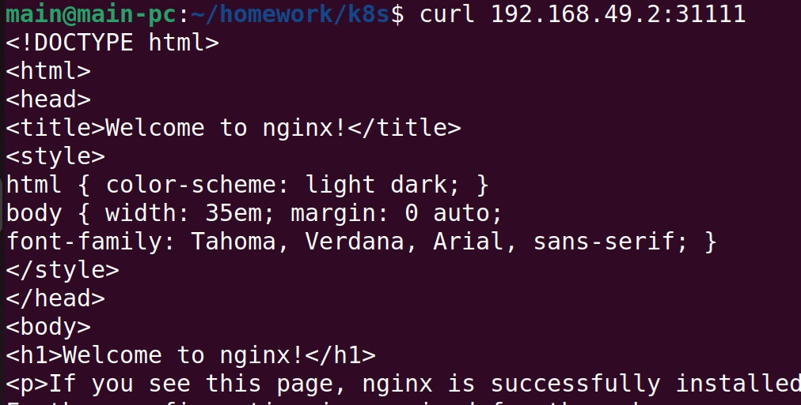

## Решение задания 2

Разворачивание двух Deployment:
https://github.com/cranberry511/kuber-homeworks_1.4/blob/main/deployment-frontend.yaml  
https://github.com/cranberry511/kuber-homeworks_1.4/blob/main/deployment-backend.yaml  
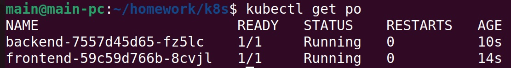

Создание Service для каждого приложения:
https://github.com/cranberry511/kuber-homeworks_1.4/blob/main/service-frontend.yaml  
https://github.com/cranberry511/kuber-homeworks_1.4/blob/main/service-backend.yaml  
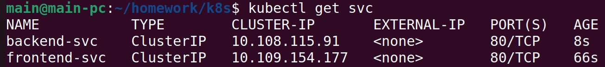

Создание Ingress:
https://github.com/cranberry511/kuber-homeworks_1.4/blob/main/ingress.yaml
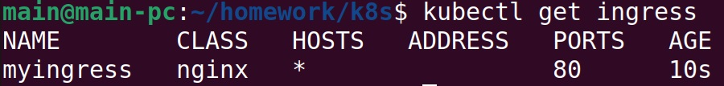

Проверка доступности:
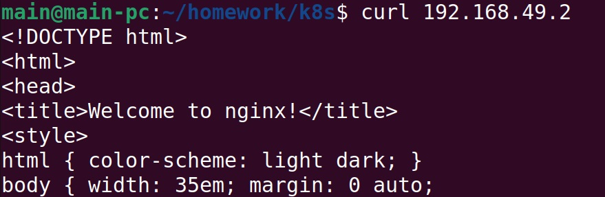

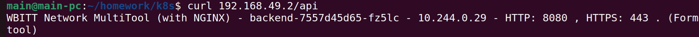